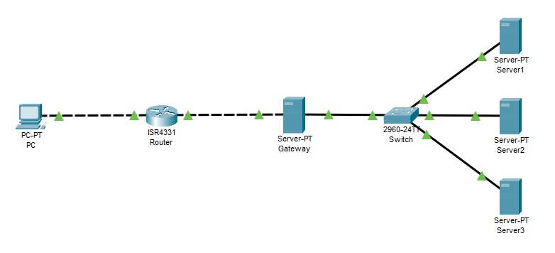

# load_balancing_nginx

Using nginx reverse proxy for load-balancing inbound requests to a web application replicated across multiple web servers.

## Architecture

- **Gateway server**
  - Running Ubuntu server.
  - Exposed to the Internet with `iptables` firewall configured to only accept HTTP traffic on port 80.
  - Has nginx installed and configured as a reverse proxy, for round-robin load balancing to backend internal servers.
- **Internal server**
  - Isolated from the Internet, connected to the gateway server network.
  - Running `nginx` web server, serving a copy of the web application
    - To visualize the results for this example, the application is a sample HTML webpage indicating server ID that served the request
    - In reality it can be a copy of the same application transparent to the user.

## Dockerizing the project

- To test the system locally before deployment, we used Docker containers with nginx for gateway (server configuration) and internal servers (webapp hosting).
- We used docker-compose to combine everything so that we can test using `docker-compose up`

## Deployment

- We deployed the explained architecture on AWS.
- The gateway server is accessible at <specify IP or hostname>
