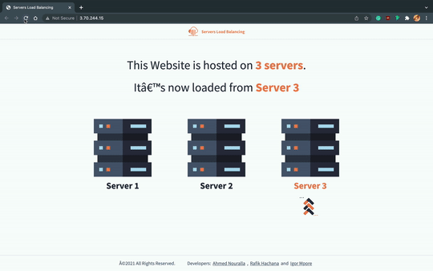
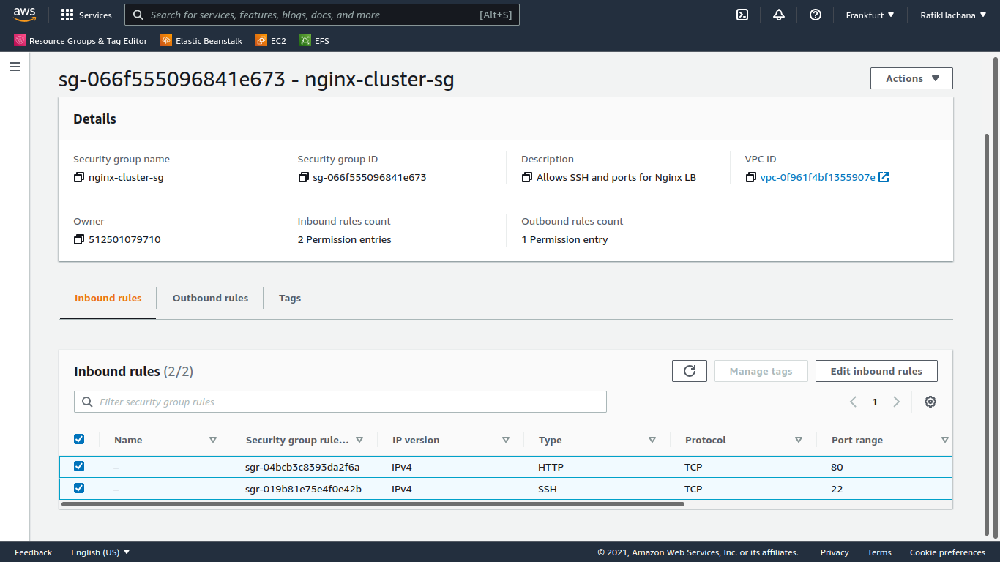
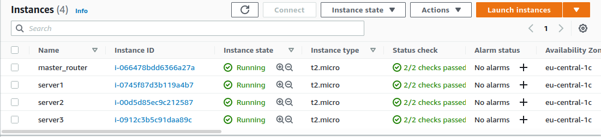
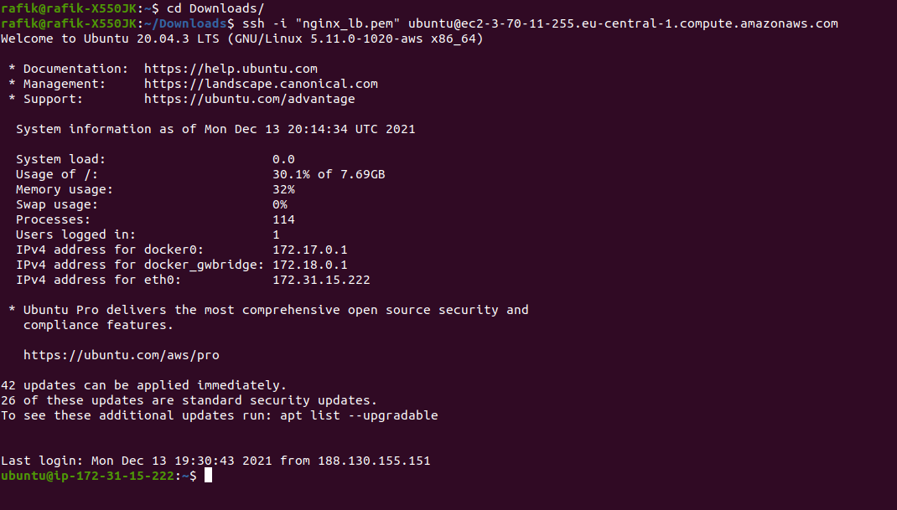

# Load Balancing using Nginx

> [GitHub repository](https://github.com/desmigor/load_balancing_nginx)
>
> Team members:
>
> - Ahmad Nouralla (a.shaaban@innopolis.university)
> - Igor Mpore (i.mpore@innopolis.university)
> - Rafik Hachana (r.hachana@innopolis.university)
>
> This project was done as a final assignment for the System and Network Administration course, Innopolis University, Fall semester 2021.

## Introduction: Our Goal

In this project, we have designed a load balanced HTTP server architecture, implemented the idea using Nginx reverse-proxy, containerized the application using Docker, and deployed the containers to EC2 server instances on Amazon Web Services. It is also possible to run the setup locally by simply cloning the source files and running `docker-compose up` in the source directory. The final deployed result can be found at  [http://3.70.244.15/](http://3.70.244.15/) . 



Our action plan is the following:

1. Designing the server architecture.
2. Create the webpages.
3. Create the necessary Nginx configuration.
4. Containerize the application.
5. Test locally with `docker-compose`
6. Deploy on AWS.

## Architecture


- **Gateway server**
  - Running Ubuntu server.
  
  - Exposed to the Internet with `iptables` firewall configured to only accept HTTP traffic on port 80.
  
  - Has nginx installed and configured as a reverse proxy, for round-robin load balancing to backend internal servers.
  
  - Nginx configuration for Round-Robbin Load Balancing:
  
    ```nginx
    
    upstream loadbalancer {
        server 172.17.0.1:5001;
        server 172.17.0.1:5002;
        server 172.17.0.1:5003;
    }
    
    server {
        location / {
            proxy_pass http://loadbalancer;
        }
    }
    ```
  
    
  
- **Internal server**
  - Isolated from the Internet, connected to the gateway server network.
  - Running `nginx` web server, serving a copy of the web application
    - To visualize the results for this example, the application is a sample HTML webpage indicating server ID that served the request
    - In reality it can be a copy of the same application transparent to the user.


## Dockerizing the project

- To test the system locally before deployment, we used Docker containers with nginx for gateway (server configuration) and internal servers (webapp hosting).
- We used docker-compose to combine everything so that we can test using `docker-compose up`


## Deployment

- We deployed the explained architecture on AWS (EC2 instances that are running docker containers)
- The gateway server is accessible at [http://3.70.244.15/](http://3.70.244.15/)

### Creating a security group and EC2 instances

First, we created an EC2 security group that only allows inbound HTTP and SSH traffic.



Then we have created 4 EC2 instances of type _t2.micro_ with the Ubuntu Server OS. We made sure to specify the security group we previously created for all the instances.



> We also make sure to create a new SSH key when configuring the instances, so that we can access them through SSH.

Then we are able to access the instances by using the SSH command and the key as an identity file. (Make sure to run `chmod 700` on the key file first)



We can copy the repo files to any of the instances by using the `scp` command:

```bash
ssh -r -i "nginx_lb.pem" /home/user/load_balancing_nginx/ ubuntu@ec2-3-70-11-255.eu-central-1.compute.amazonaws.com:~/ 
```

Once we have accessed the instance, we install docker and do the post configuration setup by running the `ec2_setup.sh` file that we have included.

```bash
sudo ./ec2_setup.sh
```

Once docker is installed we need to make some modifications to the setup, we will discuss this in different sections as it is different for the server instances and the gateway instances.

### Setting up the server replica instances

Once we are in the source directory, we have 3 folders (one for each server). We need to copy the images and static files to that folder.

```bash
cp -r images server1/images/
cp -r images server2/images/
cp -r images server3/images/
cp -r static server1/static/
cp -r static server2/static/
cp -r static server3/static/
```

Then, for each of the `Dockerfile`s that we have, we need to add a few lines to do the following:

- Copy the new static content to the container.
- Expose port 80

The Dockerfile would look like this at the end:

```Dockerfile
FROM nginx
RUN rm /usr/share/nginx/html/*
EXPOSE 80
COPY index.html /usr/share/nginx/html/index.html
COPY images/ /usr/share/nginx/html/images/
COPY static/ /usr/share/nginx/html/static/
```

Now we build the docker image, then we run it:

```bash
docker build -t server .
docker run -d -p 80:80 server
```

### Setting up the gateway server

For the server that will do the load balancing, we will need to change the `nginx.conf` file to contain the IP addresses of the 3 other servers.

```nginx
upstream loadbalancer {
    server 3.70.11.255:80;
    server 3.120.250.235:80;
    server 3.125.153.117:80;
}

server {
    location / {
        proxy_pass http://loadbalancer;
    }
}
```

The Dockerfile would look like this:

```dockerfile
FROM nginx
RUN rm /etc/nginx/conf.d/default.conf
EXPOSE 80
COPY nginx.conf /etc/nginx/conf.d/default.conf
```

Then we build the image and run the container:

```bash
docker build -t gateway .
docker run -d -p 80:80 gateway
```

___

The setup is done, the result can be found at  [http://3.70.244.15/](http://3.70.244.15/) 

## Difficulties faced

We have experienced some setbacks while working on this project, and we have also had the initial intention to experiment with the Docker Swarm service as well, but it didn't turn out to be the best option for our deployment. Docker Swarm is mainly for programmatically deploying clusters, not for fixed size clusters where we need to keep track of where each code is deployed. Manually choosing where to deploy the containers turned out to be a better option. 

Other small setbacks included common issues with specifying ports with Docker containers (forget to map to host ports when running a container from the image), correctly placing static style and image files so that the frontend HTML and style works properly.

## Conclusion

In this project, we have worked and gained practical experience with the Nginx reverse-proxy server, Docker images and containers, as well as docker-compose. We have also gained experience on how to set up a server cluster on AWS, working with the EC2 service (instances and security groups). This project was a good synthesis for the System and Network Administration course, as it has many of the taught aspects and topics of this domain.
